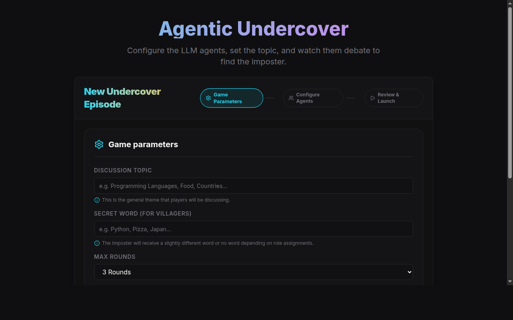

<p align="center">
  <picture>
    <source media="(prefers-color-scheme: dark)" srcset="docs/images/banner-dark.svg">
    
  </picture>
</p>

<p align="center">
  <strong>Multi-Agent LLM Social Deduction Simulation Platform</strong>
</p>

<p align="center">
  <a href="https://github.com/haise-dev/agentic-undercover-env/actions"></a>
  <a href="LICENSE"></a>
  <a href="#"></a>
  <a href="#"></a>
  <a href="#"></a>
  <a href="#"></a>
</p>

---

## What is AUE?

AUE pits **4 AI agents** — 1 Imposter and 3 Villagers — against each other in a social deduction game. Each agent is powered by a real LLM (Groq, OpenAI, Gemini, DeepSeek). Villagers know a secret word. The Imposter only knows the topic. Through structured rounds of public statements, debate, and voting, they must uncover who doesn't belong.

This is not a party game. It's a **behavioral laboratory** for studying LLM capabilities in:
- Semantic deception — speaking convincingly without knowing the secret
- Pragmatic inference — reading between the lines to find the liar
- Deductive reasoning under asymmetric information

Every LLM call, thought, statement, and vote is logged for analysis.



---

## Architecture

```
┌──────────────────────────────────────────────────────────┐
│  Web Browser                                              │
│  Next.js 16 + Tailwind CSS 4 + WebSocket client          │
└──────────────┬───────────────────────────────────────────┘
               │ HTTP + WS
               ▼
┌──────────────────────────────────────────────────────────┐
│  FastAPI Backend                                          │
│  ┌─────────────┐  ┌──────────┐  ┌──────────────────────┐ │
│  │ REST API     │  │ WS Server│  │ LangGraph Engine     │ │
│  │ /api/episodes│  │ stream   │  │ 7-node state machine │ │
│  └─────────────┘  └──────────┘  └──────────────────────┘ │
└──────┬──────────────────────────────┬────────────────────┘
       │ Redis pub/sub + events       │ SQLAlchemy async
       ▼                              ▼
┌──────────────┐           ┌──────────────────┐
│  Redis 7     │           │  PostgreSQL 16   │
│  real-time   │           │  action logs,    │
│  state       │           │  game history    │
└──────────────┘           └──────────────────┘
```

### Game State Machine

```
INIT → SPEAKING → DELIBERATION ↺ → POLLING → VOTING → REACTION → ENDGAME
                      ↑______________↓ (dynamic router loops or advances)
```

7 LangGraph nodes. The deliberation phase uses a **priority-based dynamic router** — agents take turns by direct rebuttal priority, then zero-turn agents, then free-for-all — capped at `alive_count × 4` messages with ping-pong cooldown detection.

### Model Tiering

Each agent runs **two LLM instances**: a smart model for complex reasoning (speaking, deliberation, voting) and a fast model for lightweight tasks (polling, reaction). Configurable per agent.

```
Smart model ← SPEAKING, DELIBERATION, VOTING
Fast model  ← POLLING, REACTION
```

Groq `llama-4-scout` failures auto-fallback to `llama-3.3-70b-versatile`.

### Key Engineering Details

| Feature | Implementation |
|--------|----------------|
| Structured output | Pydantic frozen models + LangChain `.with_structured_output(include_raw=True)` |
| Retry logic | 1 retry for semantic errors, 3 retries exponential backoff for network, rate limits raised immediately |
| API key isolation | 4 Groq API keys round-robin assigned via `api_key_index` |
| Quota tracking | Redis-based provider exhaustion detection with per-key usage counters |
| Deliberation intents | 7 types (ACCUSE, DEFEND, QUESTION, AGREE_WITH, etc.) with required `target_name` validator |
| Agent abstraction | `BaseAgent` ABC — AI and Human agents share the same contract |

---

## Quick Start

```bash
git clone https://github.com/haise-dev/agentic-undercover-env.git
cd agentic-undercover-env

cp .env.example .env    # Fill in your LLM API keys
make up                 # Start PostgreSQL, Redis, API, and Web frontend
```

| Service | URL |
|---------|-----|
| Web UI | http://localhost:3000 |
| API | http://localhost:8000 |
| API Docs (Swagger) | http://localhost:8000/docs |

### Environment Variables

```
GROQ_API_KEY_1=           # Agent 0 (required)
GROQ_API_KEY_2=           # Agent 1 (required)
GROQ_API_KEY_3=           # Agent 2 (required)
GROQ_API_KEY_4=           # Agent 3 (required)
DATABASE_URL=             # Pre-configured for Docker
REDIS_URL=                # Pre-configured for Docker
```

Four isolated Groq keys prevent rate-limit collisions across 4 simultaneous agents.

---

## Commands

```bash
make up           # Start all Docker services (detached)
make down         # Stop all services
make dev          # Start with rebuild + hot reload (foreground)
make build        # Rebuild all Docker images
make test         # Run backend + frontend tests
make test-api     # Backend tests only (pytest)
make test-web     # Frontend tests only (Node native test runner)
make lint         # Ruff (Python) + ESLint (TypeScript)
make format       # Auto-format both
make migrate      # Run Alembic DB migrations
make logs         # Tail all Docker logs
```

Run a single backend test:
```bash
cd apps/api && uv run pytest tests/unit/path/to/test_file.py::test_name -v
```

---

## Project Structure

```
agentic-undercover-env/
├── docker-compose.yml
├── Makefile
├── apps/
│   ├── api/                    # FastAPI Backend
│   │   ├── Dockerfile
│   │   ├── pyproject.toml      # uv deps
│   │   ├── src/
│   │   │   ├── main.py         # App entry point
│   │   │   ├── core/           # Config, Redis client, quota tracking
│   │   │   ├── models/         # Pydantic schemas, enums, outputs
│   │   │   ├── db/             # SQLAlchemy models + Alembic migrations
│   │   │   ├── engine/         # LangGraph nodes, graph builder, dynamic router
│   │   │   ├── agents/         # LangChain wrappers, prompt templates, retry
│   │   │   └── api/            # REST routes + WebSocket endpoints
│   │   └── tests/              # pytest (unit + integration)
│   │
│   └── web/                    # Next.js 16 Frontend
│       ├── Dockerfile
│       ├── package.json
│       └── src/
│           ├── components/     # setup wizard, chat feed, agent roster
│           ├── lib/            # WebSocket client, Zustand store, types
│           └── store/          # Zustand setup wizard state
│
└── docs/
    ├── ARCHITECTURE.md
    ├── GAME_RULES_SPEC.md
    ├── DATA_SCHEMA.md
    ├── AGENT_DESIGN.md
    └── PRD.md
```

---

## Testing

| Layer | Tech | Notes |
|-------|------|-------|
| Backend unit | pytest + MockAgent | Tests nodes, routers, outputs in isolation |
| Backend integration | pytest + fakeredis + aiosqlite | Full pipeline with mocked LLM, no real Redis/DB |
| Frontend | Node native test runner | `--experimental-strip-types` for TS directly |

MockAgent test double returns configurable outputs per phase — speak, deliberate, poll, vote, react — with fallback defaults on `StopIteration`.

---

## Documentation

Full design specs in `/docs`:

| Document | Content |
|----------|---------|
| [ARCHITECTURE.md](docs/ARCHITECTURE.md) | System design, tech stack, communication patterns |
| [DATA_SCHEMA.md](docs/DATA_SCHEMA.md) | Full Pydantic models, field visibility matrix |
| [GAME_RULES_SPEC.md](docs/GAME_RULES_SPEC.md) | Game design: roles, phases, win conditions |
| [AGENT_DESIGN.md](docs/AGENT_DESIGN.md) | Cognitive architecture: 3-layer reasoning, CoT prompts |
| [PRD.md](docs/PRD.md) | Original product requirements, roadmap, out-of-scope |

---

## Development Status

```
Sprint 1 ✅   Linear pipeline (INIT → SPEAKING → VOTING → REACTION → ENDGAME)
Sprint 2 ✅   Full LangGraph state machine, dynamic deliberation router,
              delivery intents, model tiering, WebSocket streaming
Sprint 3 ⬜   Human player support, evaluation analytics
```

---

## License

MIT — see [LICENSE](LICENSE).